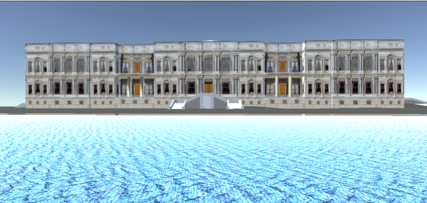

# Touristic-Places-of-Istanbul-Navigation-App-COMP-410-Group-Project-

This simple project was a group project with Melodi Ezgi Keskin for our COMP 410 (COMPUTER GRAPHICS) course at Koc University. We used unity to create navigable models of 4 places in Istanbul, Turkey.
With this project, we learned unity and got familiar with different aspects of game development in unity.
The four places shown were:
- Abbasaga Park, Besiktas
- Galata Tower
- Maiden Tower
- Ciragan Palace

## Visuals
Here, we have some sample screenshots from the scenes:

### Initial Menu View

### Abbasaga Park, Besiktas View

### Maiden Tower View

### Galata Tower View

### Ciragan Palace View

